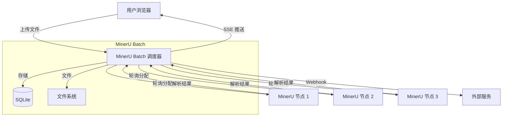

# MinerU Batch

<div align="center">

**批量 PDF / 文档解析工具，基于 MinerU API**

[](https://python.org)
[](https://vuejs.org)
[](https://fastapi.tiangolo.com)
[](LICENSE)

[English](./README_en.md) | 中文

</div>

---

## 界面预览

<div align="center">

<p><em>Dashboard：任务统计、趋势图表、文件类型分布</em></p>
</div>

<div align="center">

<p><em>上传解析：拖拽文件夹、分批并发上传、实时进度</em></p>
</div>

<div align="center">

<p><em>Markdown 预览：渲染/源码切换、全文搜索高亮</em></p>
</div>

## 功能特性



**核心能力：**
- 多节点负载均衡（Round-Robin）
- 异步任务队列（并发可控）
- ZIP 流自动解压（Bundle 产物保留）
- Webhook 自动推送（闭环流水线）

## 功能特性

- **批量上传解析** — 拖拽上传 PDF / 图片 / Word / PPT / Excel，自动排队处理
- **文件夹拖拽** — 直接拖拽文件夹到上传区域，自动识别并保留目录结构
- **多节点负载均衡** — 配置多个 MinerU 服务节点，轮询分配任务
- **RAG Bundle 输出** — 支持保存 images / json / md 完整产物，适配 RAG 知识库搭建
- **实时状态推送** — SSE 实时推送任务状态，支持浏览器桌面通知
- **Markdown 预览** — 内置渲染预览，支持源码切换、全文搜索高亮、异步渲染
- **任务管理** — 批量重试 / 删除 / 转换 / 下载，CSV 导出，一键套用任务参数
- **解析场景选择** — 上传时一键切换学术论文/纯文本/扫描件 OCR 场景预设，自动覆盖解析参数
- **趋势图表** — Dashboard 展示 7 天趋势、文件类型分布
- **存储清理** — 一键清理已完成任务原文件，释放磁盘空间
- **移动端适配** — 响应式布局，侧边栏自动收起

## 快速启动

### 方式一：Make（推荐）

```bash
# 生产模式 — 自动构建前端 + 启动服务
make prod
```

访问 http://localhost:8900

### 方式二：Docker

```bash
docker compose up -d
```

数据持久化在 Docker volume `data` 中。

### 方式三：开发模式

```bash
make dev
```

前后端分离运行，支持热更新：
- 前端：http://localhost:3001
- 后端：http://localhost:8900/docs

## 功能说明

### Dashboard 概览

- 任务统计卡片（总数 / 等待 / 处理中 / 完成 / 失败）
- 成功率、平均耗时、磁盘占用
- 近 7 天完成/失败趋势图
- 文件类型分布饼图

### 上传解析

- 拖拽或点击上传，支持批量，可直接拖拽文件夹自动识别
- 自动检测文档格式（Word/PPT/Excel），可选自动转 PDF
- 上传进度实时显示（速度 + 预计剩余时间）
- 解析场景选择：学术论文 / 纯文本 / 扫描件 OCR 一键切换，自动覆盖解析参数
- 每批上传可独立勾选要使用的 MinerU 节点，默认全选已启用的节点

### 任务管理

- 任务列表支持搜索、状态筛选、排序
- 点击任务行查看详情抽屉（时间线、MinerU 参数、错误堆栈）
- 批量操作：重试 / 删除 / 转换 / 下载
- 重试时可选保持原节点、切换到其他已启用节点、或填写自定义 URL
- 一键套用任务参数，快速复现解析配置
- 移动端自动切换为卡片布局

### 预览与搜索

- Markdown 异步渲染预览，代码块语法高亮
- 源码 / 渲染模式切换
- 全文搜索，匹配高亮 + 上下跳转

## 环境变量

| 变量 | 默认值 | 说明 |
|------|--------|------|
| `DEV_MODE` | — | 设为 `1` 跳过静态文件服务 |
| `CORS_ORIGINS` | — | 允许的跨域来源（逗号分隔） |
| `UPLOAD_DIR` | `./uploads` | 上传文件目录 |
| `OUTPUT_DIR` | `./outputs` | 输出文件目录 |
| `CONVERT_DIR` | `./converted` | 文档转换目录 |
| `DATABASE_URL` | `sqlite:///./mineru_batch.db` | 数据库连接 URL |

## 目录结构

```
mineru-batch/
├── backend/
│   ├── main.py          # FastAPI 入口 + 前端静态服务
│   ├── routes.py        # API 路由（上传、任务、日志、统计）
│   ├── models.py        # SQLAlchemy 模型
│   ├── requirements.txt
│   └── tests/           # pytest 测试套件
├── frontend/
│   ├── src/
│   │   ├── views/       # 页面组件
│   │   ├── stores/      # 配置状态管理
│   │   ├── utils/       # 工具函数
│   │   └── api.ts       # API 封装
│   ├── public/
│   └── vite.config.ts
├── docker-compose.yml
├── Dockerfile
├── Makefile
└── start.sh
```

## 技术栈

| 层 | 技术 |
|----|------|
| 前端 | Vue 3 + TypeScript + Element Plus + ECharts |
| 后端 | FastAPI + SQLAlchemy + SQLite |
| 文档转换 | LibreOffice (headless) |
| 部署 | Docker / Make / uvicorn |

## API 端点

| 方法 | 路径 | 说明 |
|------|------|------|
| `POST` | `/api/upload` | 上传文件并创建任务 |
| `GET` | `/api/tasks` | 任务列表（分页、筛选） |
| `GET` | `/api/tasks/{id}` | 任务详情 |
| `POST` | `/api/tasks/{id}/retry` | 重试任务 |
| `POST` | `/api/tasks/{id}/cancel` | 取消任务 |
| `DELETE` | `/api/tasks/{id}` | 删除任务 |
| `GET` | `/api/tasks/{id}/preview` | 预览结果 |
| `GET` | `/api/tasks/{id}/download` | 下载结果 |
| `GET` | `/api/stats` | 统计概览 |
| `GET` | `/api/stats/trend` | 趋势数据 |
| `GET` | `/api/stats/filetypes` | 文件类型分布 |
| `GET` | `/api/logs` | 日志列表 |
| `GET` | `/api/storage` | 存储占用 |
| `POST` | `/api/storage/clean` | 清理指定目录 |
| `POST` | `/api/storage/clean-sources` | 清理已完成任务原文件 |

完整 API 文档：http://localhost:8900/docs

## RAG 知识库最佳实践

MinerU Batch 的核心价值是为大模型知识库提供高质量语料。以下是典型工作流：

### 场景：批量处理技术文档入库

```bash
# 1. 准备文档目录
mkdir -p ~/rag-source-docs
# 将 PDF/Word/PPT 放入目录

# 2. 启动 MinerU Batch
make prod

# 3. 在设置页配置 MinerU 节点
# 填入你的 MinerU API 地址

# 4. 拖拽整个文件夹到上传区域
# 系统自动保留目录结构

# 5. 等待解析完成，下载 Bundle
# Bundle 包含: output.md + images/ + content_list.json
```

### 配置推荐

| 场景 | parse_method | formula_enable | table_enable | return_images |
|------|--------------|----------------|--------------|---------------|
| 技术文档 | auto | true | true | true |
| 学术论文 | auto | true | true | true |
| 纯文本报告 | txt | false | false | false |
| 扫描件 OCR | ocr | true | true | true |

### Webhook 自动推送

配置 Webhook URL 后，任务完成时自动推送结果：

```json
{
  "task_id": 42,
  "filename": "paper.pdf",
  "status": "completed",
  "output_format": "md",
  "content": "...解析后的Markdown内容...",
  "images": ["img1.png", "img2.png"]
}
```

适用于：Dify、FastGPT、LangChain 等 RAG 框架的数据导入。

## 开发

```bash
# 安装后端依赖
pip install -r backend/requirements.txt

# 安装前端依赖
cd frontend && npm install

# 运行测试
make test

# 构建前端
make build

# 清理
make clean
```

## 硬件与依赖说明

> **MinerU Batch 本身是轻量级调度平台**（占用不到 200MB 内存），重负载发生在你配置的 MinerU API 节点上。因此可以轻松部署在树莓派或 1核2G 的轻量云服务器上。

- **Docker 部署**：已内置 LibreOffice，无需额外安装
- **make prod 部署**：需在宿主机安装 LibreOffice（`apt install libreoffice`）

## 常见问题 (FAQ)

**Q: 上传大文件提示 413 Request Entity Too Large？**

A: 如果使用了 Nginx 反向代理，需修改配置：
```nginx
client_max_body_size 500m;
```

**Q: DOCX 自动转 PDF 失败？**

A: 检查系统中是否安装了 LibreOffice：
```bash
# Ubuntu/Debian
sudo apt install libreoffice

# CentOS/RHEL
sudo yum install libreoffice
```

**Q: 如何配置多个 MinerU 节点实现负载均衡？**

A: 在"系统设置"页面添加多个节点，系统会自动轮询分配任务。

**Q: 上传进度卡在某个百分比不动？**

A: 可能是网络波动导致，系统会自动重试。如果持续不动，可刷新页面重新上传。

**Q: 如何为 RAG 知识库批量处理文档？**

A: 参考上方"RAG 知识库最佳实践"章节，推荐配置 `return_images: true` 以保留图片。

## 许可证

MIT
