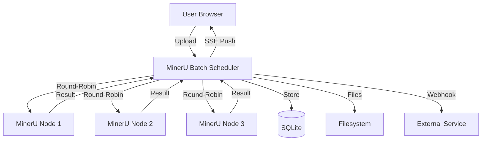

# MinerU Batch

<div align="center">

**Batch PDF / Document Parsing Tool powered by MinerU API**

[](https://python.org)
[](https://vuejs.org)
[](https://fastapi.tiangolo.com)
[](LICENSE)

English | [中文](./README.md)

</div>

---

## Screenshots

<div align="center">

<p><em>Dashboard: Task statistics, trend charts, file type distribution</em></p>
</div>

<div align="center">

<p><em>Upload: Drag & drop folders, batch concurrent upload, real-time progress</em></p>
</div>

<div align="center">

<p><em>Markdown Preview: Render/source toggle, full-text search highlighting</em></p>
</div>

## Features



**Core Capabilities:**
- Multi-node load balancing (Round-Robin)
- Async task queue (concurrency control)
- ZIP stream auto-extraction (Bundle output preservation)
- Webhook auto-push (pipeline integration)

## Features

- **Batch Upload & Parse** — Drag & drop PDF / Images / Word / PPT / Excel, auto-queue processing
- **Folder Drag & Drop** — Directly drag folders to upload area, auto-detect and preserve directory structure
- **Multi-node Load Balancing** — Configure multiple MinerU service nodes, round-robin task distribution
- **RAG Bundle Output** — Support saving images / json / md complete artifacts, perfect for RAG knowledge base building
- **Real-time Status Push** — SSE real-time task status push, browser desktop notification support
- **Markdown Preview** — Built-in rendered preview, source code toggle, full-text search highlighting, async rendering
- **Task Management** — Batch retry / delete / convert / download, CSV export, one-click apply task parameters
- **Parse Scenario Presets** — One-click switch between Academic/Plain Text/OCR presets on upload, auto-override parse parameters
- **Trend Charts** — Dashboard displays 7-day trends, file type distribution
- **Storage Cleanup** — One-click cleanup of completed task source files, free disk space
- **Mobile Responsive** — Responsive layout, sidebar auto-collapse

## Quick Start

### Option 1: Make (Recommended)

```bash
# Production mode — auto-build frontend + start service
make prod
```

Visit http://localhost:8900

### Option 2: Docker

```bash
cp .env.example .env
# Adjust APP_PORT, ADMIN_API_KEY, ALLOW_PRIVATE_ENDPOINTS as needed
docker compose --env-file .env up -d
```

Data persisted in Docker volume `data`. For production, set `ADMIN_API_KEY` and enable `ALLOW_PRIVATE_ENDPOINTS=true` only in trusted private networks.

### Offline Deployment

```bash
bash prepare-offline.sh
# Copy generated mineru-batch-offline-*.tar.gz to target machine, extract it, then run deploy.sh
```

Offline upgrade:

```bash
bash update-offline.sh mineru-batch-offline-vX.Y.Z.tar.gz
```

### Option 3: Development Mode

```bash
make dev
```

Frontend and backend run separately with hot reload:
- Frontend: http://localhost:3001
- Backend: http://localhost:8900/docs

## Feature Details

### Dashboard Overview

- Task statistics cards (Total / Pending / Processing / Completed / Failed)
- Success rate, average duration, disk usage
- 7-day completion/failure trend chart
- File type distribution pie chart

### Upload & Parse

- Drag & drop or click to upload, batch support, direct folder drag & drop auto-detection
- Auto-detect document format (Word/PPT/Excel), optional auto-convert to PDF
- Real-time upload progress display (speed + estimated remaining time)
- Parse scenario selection: Academic / Plain Text / OCR, auto-override parse parameters
- Per-batch node selection: pick which MinerU nodes to use for each upload batch, defaults to all enabled nodes

### Task Management

- Task list supports search, status filter, sort
- Click task row to view detail drawer (timeline, MinerU parameters, error stack)
- Batch operations: retry / delete / convert / download
- Retry with node selection: keep original node, switch to another enabled node, or use a custom URL
- One-click apply task parameters, quickly reproduce parse config
- Mobile auto-switch to card layout

### Preview & Search

- Markdown async rendered preview, code block syntax highlighting
- Source / rendered mode toggle
- Full-text search, match highlighting + up/down navigation

## Environment Variables

| Variable | Default | Description |
|----------|---------|-------------|
| `DEV_MODE` | — | Set to `1` to skip static file serving |
| `CORS_ORIGINS` | — | Allowed CORS origins (comma-separated) |
| `UPLOAD_DIR` | `./uploads` | Upload file directory |
| `OUTPUT_DIR` | `./outputs` | Output file directory |
| `CONVERT_DIR` | `./converted` | Document conversion directory |
| `DATABASE_URL` | `sqlite:///./mineru_batch.db` | Database connection URL |
| `ADMIN_API_KEY` | — | Admin API key; required for delete, retry, cleanup, and settings updates when set |
| `ALLOW_PRIVATE_ENDPOINTS` | `true` | Whether MinerU endpoints may use private/internal addresses; set to `false` for public production deployments |
| `TAG` | `v0.1.0` | Docker Compose image tag |
| `APP_PORT` | `8900` | Docker Compose published port |
| `TZ` | `Asia/Shanghai` | Container timezone |
| `VITE_API_BASE_URL` | `/api` | Backend API base URL for split frontend/backend deployments |

## Directory Structure

```
mineru-batch/
├── backend/
│   ├── main.py          # FastAPI entry + frontend static serving
│   ├── routes.py        # API routes (upload, tasks, logs, stats)
│   ├── models.py        # SQLAlchemy models
│   ├── requirements.txt
│   └── tests/           # pytest test suite (68+ tests)
├── frontend/
│   ├── src/
│   │   ├── views/       # Page components
│   │   ├── stores/      # Config state management
│   │   ├── utils/       # Utility functions
│   │   └── api.ts       # API wrapper
│   ├── public/
│   └── vite.config.ts
├── docker-compose.yml
├── Dockerfile
├── .env.example
├── prepare-offline.sh
├── update-offline.sh
├── Makefile
└── start.sh
```

## Tech Stack

| Layer | Technology |
|-------|------------|
| Frontend | Vue 3 + TypeScript + Element Plus + ECharts + Marked |
| Backend | FastAPI + SQLAlchemy + SQLite / PostgreSQL |
| Document Conversion | LibreOffice (headless) |
| Deployment | Docker / Make / uvicorn |

## API Endpoints

| Method | Path | Description |
|--------|------|-------------|
| `POST` | `/api/upload` | Upload files and create tasks |
| `GET` | `/api/tasks` | Task list (paginated, filtered) |
| `GET` | `/api/tasks/events` | Realtime task status SSE stream |
| `GET` | `/api/tasks/since` | Sync task updates missed during disconnects |
| `GET` | `/api/tasks/{id}` | Task details |
| `PUT` | `/api/tasks/{id}` | Update task parse parameters |
| `DELETE` | `/api/tasks/{id}` | Delete task |
| `POST` | `/api/tasks/{id}/retry` | Retry task |
| `POST` | `/api/tasks/{id}/cancel` | Cancel task |
| `POST` | `/api/tasks/{id}/convert` | Convert document to PDF |
| `GET` | `/api/tasks/{id}/preview` | Preview result |
| `PUT` | `/api/tasks/{id}/content` | Save edited result content |
| `GET` | `/api/tasks/{id}/download` | Download result |
| `DELETE` | `/api/tasks/batch` | Batch delete tasks |
| `POST` | `/api/tasks/batch/retry` | Batch retry tasks |
| `POST` | `/api/tasks/batch/convert` | Batch convert documents to PDF |
| `GET` | `/api/tasks/batch/download` | Batch download results |
| `GET` | `/api/stats` | Statistics overview |
| `GET` | `/api/stats/trend` | Trend data |
| `GET` | `/api/stats/filetypes` | File type distribution |
| `GET` | `/api/reports/quality` | Quality report |
| `GET` | `/api/settings` | Read server settings |
| `PUT` | `/api/settings` | Save server settings |
| `GET` | `/api/security/status` | Security configuration status |
| `GET` | `/api/concurrency` | Read worker concurrency |
| `PUT` | `/api/concurrency` | Set worker concurrency |
| `POST` | `/api/test-connection` | Test MinerU node connection |
| `GET` | `/api/logs` | Log list |
| `GET` | `/api/logs/grouped` | Grouped logs |
| `DELETE` | `/api/logs` | Clear logs |
| `GET` | `/api/logs/mineru-container` | Raw MinerU container logs |
| `GET` | `/api/storage` | Storage usage |
| `POST` | `/api/storage/clean` | Clean specified directory |
| `POST` | `/api/storage/clean-sources` | Clean completed task source files |

Full API documentation: http://localhost:8900/docs

## RAG Knowledge Base Best Practices

The core value of MinerU Batch is providing high-quality corpus for LLM knowledge bases.

### Scenario: Batch Process Technical Documents

```bash
# 1. Prepare document directory
mkdir -p ~/rag-source-docs
# Place PDF/Word/PPT files

# 2. Start MinerU Batch
make prod

# 3. Configure MinerU nodes in Settings page

# 4. Drag entire folder to upload area
# System auto-preserves directory structure

# 5. Wait for parsing, download Bundle
# Bundle contains: output.md + images/ + content_list.json
```

### Recommended Config

| Scenario | parse_method | formula_enable | table_enable | return_images |
|----------|--------------|----------------|--------------|---------------|
| Technical Docs | auto | true | true | true |
| Academic Papers | auto | true | true | true |
| Plain Text Reports | txt | false | false | false |
| Scanned PDFs | ocr | true | true | true |

### Webhook Auto-Push

Configure Webhook URL to auto-push results on task completion:

```json
{
  "task_id": 42,
  "filename": "paper.pdf",
  "status": "completed",
  "output_format": "md",
  "content": "...parsed Markdown content...",
  "images": ["img1.png", "img2.png"]
}
```

Compatible with: Dify, FastGPT, LangChain and other RAG frameworks.

## Development

```bash
# Install backend dependencies
pip install -r backend/requirements.txt

# Install frontend dependencies
cd frontend && npm install

# Run tests
make test

# Build frontend
make build

# Clean
make clean
```

## License

MIT
